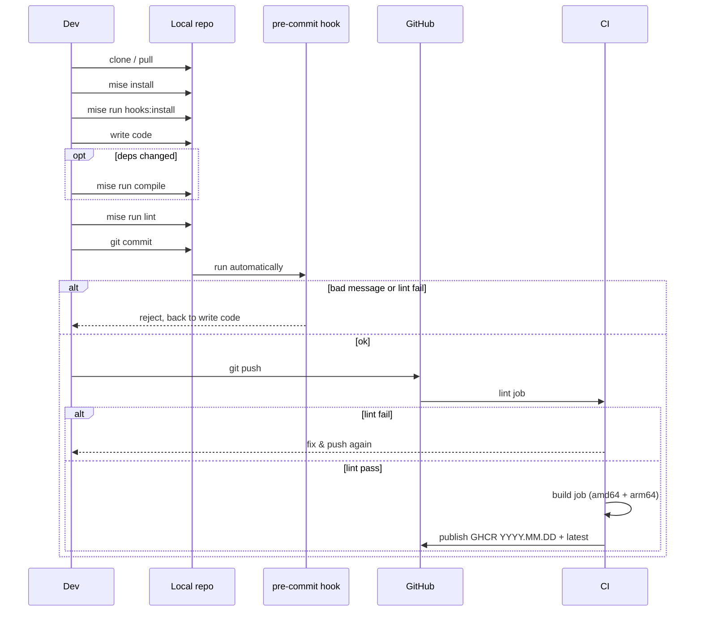

# Contributing

## Dev workflow



## Conventional commits

Commit messages must follow [Conventional Commits](https://www.conventionalcommits.org/). The pre-commit hook enforces this locally; CI enforces it on every push.

Allowed types: `feat`, `fix`, `docs`, `style`, `refactor`, `perf`, `test`, `build`, `ci`, `chore`, `revert`

Examples:

```
feat: add object storage usage scan
fix: resolve f-string backslash syntax error
chore: repin requirements
```
