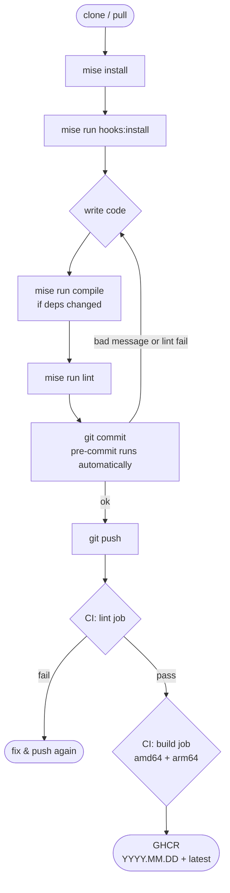

# oci-free-tier-monitor

[](https://github.com/syscode-labs/oci-free-tier-monitor/actions/workflows/docker.yml)


Active OCI cost and resource monitor with Telegram alerts and auto-cleanup. Runs as a container, checks on a configurable schedule, and reacts to bot commands.

## Features

- **Cost alerting** — monthly spend vs a configurable GBP threshold
- **Change-gated scheduled alerts** — enabled by default; repeated non-threshold findings only alert when they change
- **Load balancer count** — alerts when active LBs exceed the free tier limit
- **Orphaned reserved public IPs** — detects and auto-deletes unassigned IPs burning budget
- **Orphaned volumes** — detects and auto-deletes unattached boot/block volumes
- **Volume backup scan** — detects unexpected backups consuming storage quota
- **Custom image scan** — detects unused imported images taking up Object Storage
- **Object Storage usage** — tracks total bucket usage against the 20 GB free tier limit
- **Auto-cleanup** — enabled by default; deletes orphans automatically each check cycle
- **Month-end invoice preview** — on the last 2 days of the month, sends a one-off 🧾 message with VAT-inclusive total and per-service cost breakdown
- **Telegram bot commands** — `/status`, `/scan`, `/autocleanup`, `/threshold`, `/silence`, and more
- **State persistence** — preferences saved to OCI Object Storage with local fallback
- **Cleanup reports** — each cleanup run stored as JSON in the configured bucket

## Quick start

```bash
docker run -d \
  --name oci-monitor \
  --restart unless-stopped \
  -v /path/to/appdata:/data \
  -e OCI_TENANCY_OCID=ocid1.tenancy.oc1.. \
  -e OCI_USER_OCID=ocid1.user.oc1.. \
  -e OCI_FINGERPRINT=xx:xx:xx:... \
  -e OCI_REGION=uk-london-1 \
  -e OCI_API_KEY="$(cat ~/.oci/api_key.pem)" \
  -e OCI_COMPARTMENT_OCID=ocid1.compartment.oc1.. \
  -e TELEGRAM_BOT_TOKEN=<token> \
  -e TELEGRAM_CHAT_ID=<chat_id> \
  ghcr.io/syscode-labs/oci-free-tier-monitor:latest
```

## Environment variables

| Variable | Required | Default | Description |
|---|---|---|---|
| `OCI_TENANCY_OCID` | ✅ | — | Tenancy root OCID |
| `OCI_USER_OCID` | ✅ | — | API user OCID |
| `OCI_FINGERPRINT` | ✅ | — | API key fingerprint |
| `OCI_REGION` | ✅ | `uk-london-1` | OCI home region |
| `OCI_API_KEY` | ✅ | — | PEM private key content (full key including headers) |
| `OCI_COMPARTMENT_OCID` | ✅ | — | Compartment to monitor for resources |
| `TELEGRAM_BOT_TOKEN` | ✅ | — | Bot token from [@BotFather](https://t.me/BotFather) |
| `TELEGRAM_CHAT_ID` | ✅ | — | Chat or user ID to send alerts to |
| `COST_THRESHOLD_GBP` | | `5.0` | Monthly spend threshold in GBP (compared against VAT-inclusive spend) |
| `VAT_RATE` | | `0.20` | VAT rate applied to OCI ex-VAT amounts before display and threshold comparison |
| `MAX_LB_COUNT` | | `1` | Max allowed active load balancers |
| `MAX_FREE_PUBLIC_IPS` | | `2` | Unassigned reserved IPs before alerting (OCI free tier: 2) |
| `MAX_OBJECT_STORAGE_GB` | | `18.0` | Object Storage alert threshold in GB (free tier limit: 20 GB) |
| `ALERT_ON_CHANGE` | | `true` | When enabled, scheduled non-threshold findings alert only when the finding set changes |
| `CHECK_INTERVAL_HOURS` | | `6` | How often to run checks |
| `OCI_STATE_BUCKET` | | — | Object Storage bucket for state and cleanup reports |
| `OCI_ACCOUNT_LABEL` | | compartment name | Display name shown in alerts and status messages (e.g. `oci@example.com-123456`) |

All thresholds can also be changed at runtime via Telegram commands and are persisted to the state bucket.

Scheduled checks always send threshold breaches and check failures. Non-threshold findings such as empty load balancers, orphaned volumes, backups, and unused custom images are sent when they first appear, change, or clear, which avoids repeating the same finding every interval.

On the last 2 days of each calendar month, a single invoice preview message is sent (regardless of threshold) showing the VAT-inclusive total and a breakdown by OCI service. It fires at most once per month.

## OCI IAM policy

Run the setup script to create the dedicated user, group, and policies automatically:

```bash
export OCI_TENANCY_OCID=ocid1.tenancy.oc1..
export OCI_COMPARTMENT_OCID=ocid1.compartment.oc1..
export OCI_STATE_BUCKET=your-state-bucket   # optional — scopes the object manage policy

mise run iam:setup
# or: make iam-setup
```

The script is idempotent — safe to re-run if policies need updating. At the end it prints a direct link to attach an API key to the created user in the Console.

> Requires the [OCI CLI](https://docs.oracle.com/en-us/iaas/Content/API/SDKDocs/cliinstall.htm) configured with credentials that have IAM write access at the tenancy root.

## Telegram setup

1. Message [@BotFather](https://t.me/BotFather), run `/newbot`, and copy the token into `TELEGRAM_BOT_TOKEN`.
2. Find your chat ID: message [@userinfobot](https://t.me/userinfobot) or send any message to your bot and call `https://api.telegram.org/bot<TOKEN>/getUpdates` — the `chat.id` field is what you need.

## Bot commands

| Command | Description |
|---|---|
| `/status` | Current spend, LB count, orphaned IPs and volumes |
| `/scan` | Full resource audit — every instance, LB, IP, and orphaned volume listed |
| `/autocleanup` | Show whether auto-cleanup is on or off |
| `/autocleanup on\|off` | Enable or disable automatic deletion of orphaned resources |
| `/threshold <GBP>` | Set monthly cost alert threshold |
| `/lbmax <n>` | Set maximum allowed load balancers |
| `/silence` | Mute scheduled alerts for the current calendar month |
| `/unsilence` | Re-enable scheduled alerts |
| `/help` | Show command list |

## State and reports

When `OCI_STATE_BUCKET` is set, the monitor stores:

| Path in bucket | Contents |
|---|---|
| `oci-monitor/state.json` | Current preferences (thresholds, silence, auto-cleanup flag) |
| `oci-monitor/reports/<timestamp>.json` | Cleanup report per cycle that deleted something |

If the bucket is unreachable, the container falls back to `/data/state.json` (the bind-mounted volume). Both are always written on every preference change.

## Auto-cleanup behaviour

When enabled (default), each check cycle:

1. Orphaned reserved public IPs in `AVAILABLE` state are deleted (after allowing for `MAX_FREE_PUBLIC_IPS`)
2. Boot volumes in `AVAILABLE` state with no active attachment are deleted
3. Block (data) volumes in `AVAILABLE` state are deleted
4. A Telegram message is sent summarising what was removed
5. A JSON report is written to the state bucket

Disable with `/autocleanup off` or by setting `auto_cleanup: false` in `state.json` before starting.

## Development

### Prerequisites

- [mise](https://mise.jdx.dev/) — manages `pip-tools` and `pre-commit` via pipx
- Docker (for local builds)

### Setup

```bash
mise install          # install pip-tools and pre-commit via pipx
mise run hooks:install  # install pre-commit hooks (lint + conventional commits)
```

### Tasks

| Command | Makefile equivalent | Description |
|---|---|---|
| `mise run compile` | `make compile` | Repin `requirements.txt` from `requirements.in` |
| `mise run lint` | `make lint` | Run all pre-commit checks |
| `mise run test` | `make test` | Run test suite |
| `mise run build` | `make build` | Build Docker image locally |
| `mise run iam:setup` | `make iam-setup` | Create OCI user, group, and policies |

### Adding or updating dependencies

Edit `requirements.in`, then run:

```bash
mise run compile
```

Commit both `requirements.in` and the updated `requirements.txt`.

### Dev workflow



### Conventional commits

Commit messages must follow [Conventional Commits](https://www.conventionalcommits.org/). The pre-commit hook enforces this locally; CI enforces it on every push.

Allowed types: `feat`, `fix`, `docs`, `style`, `refactor`, `perf`, `test`, `build`, `ci`, `chore`, `revert`

Examples:

```
feat: add object storage usage scan
fix: resolve f-string backslash syntax error
chore: repin requirements
```
