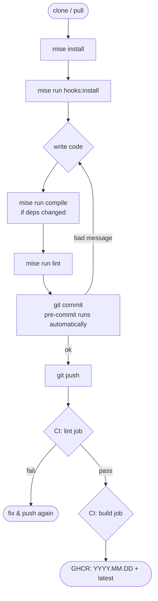

# Release Artifacts & Tooling Design

## Overview

Add pinned dependency management, a consistent task runner (mise + Makefile), conventional commit enforcement (local + CI), and CalVer Docker image tagging.

---

## 1. Requirements Management

| File | Purpose |
|---|---|
| `requirements.in` | Loose deps: `oci`, `requests` |
| `requirements.txt` | pip-compile output — fully pinned with hashes |

`pip-tools` and `pre-commit` are installed via `pipx`, managed by mise.

The Dockerfile switches from the hardcoded `pip install oci requests` to:

```dockerfile
COPY requirements.txt .
RUN pip install --no-cache-dir -r requirements.txt
```

---

## 2. Task Runner

### Primary: mise (`mise.toml`)

| Task | Command |
|---|---|
| `compile` | `pip-compile requirements.in -o requirements.txt --generate-hashes` |
| `hooks:install` | `pre-commit install && pre-commit install --hook-type commit-msg` |
| `lint` | `pre-commit run --all-files` |
| `test` | `python -m pytest tests/` |
| `build` | `docker build -t oci-free-tier-monitor .` |

Tools managed by mise via the pipx backend:

```toml
[tools]
"pipx:pip-tools" = "latest"
"pipx:pre-commit" = "latest"
```

### Fallback: Makefile

Mirrors all mise tasks as `make` targets — no extra deps required.

---

## 3. Conventional Commits Enforcement

### Local (pre-commit)

`.pre-commit-config.yaml` hooks:

| Hook | Stage | Purpose |
|---|---|---|
| `conventional-pre-commit` | `commit-msg` | Blocks non-conventional messages |
| `pre-commit-hooks` (trailing-whitespace, end-of-file-fixer, check-yaml, check-json, detect-private-key) | `pre-commit` | General hygiene |
| `ruff` | `pre-commit` | Python lint + format |

Install with: `mise run hooks:install`

### CI (GitHub Actions)

A `lint` job runs on every push:
1. Checks HEAD commit message via `conventional-pre-commit`
2. Runs `pre-commit run --all-files` on the codebase

The `build` job depends on `lint` — bad commits cannot produce images.

---

## 4. Docker Image Tagging (CalVer)

| Tag | Example | When |
|---|---|---|
| `YYYY.MM.DD` | `2026.05.11` | Every push to `main` |
| `latest` | — | Every push to `main` |

Short-SHA tag is dropped (date provides sufficient traceability).

---

## Dev Workflow



---

## Files Changed / Created

| Path | Action |
|---|---|
| `requirements.in` | new |
| `requirements.txt` | new (generated) |
| `mise.toml` | new |
| `Makefile` | new |
| `.pre-commit-config.yaml` | new |
| `Dockerfile` | update — use `requirements.txt` |
| `.github/workflows/docker.yml` | update — add lint job, CalVer tags |
| `README.md` | update — add dev workflow section with mermaid diagram |
